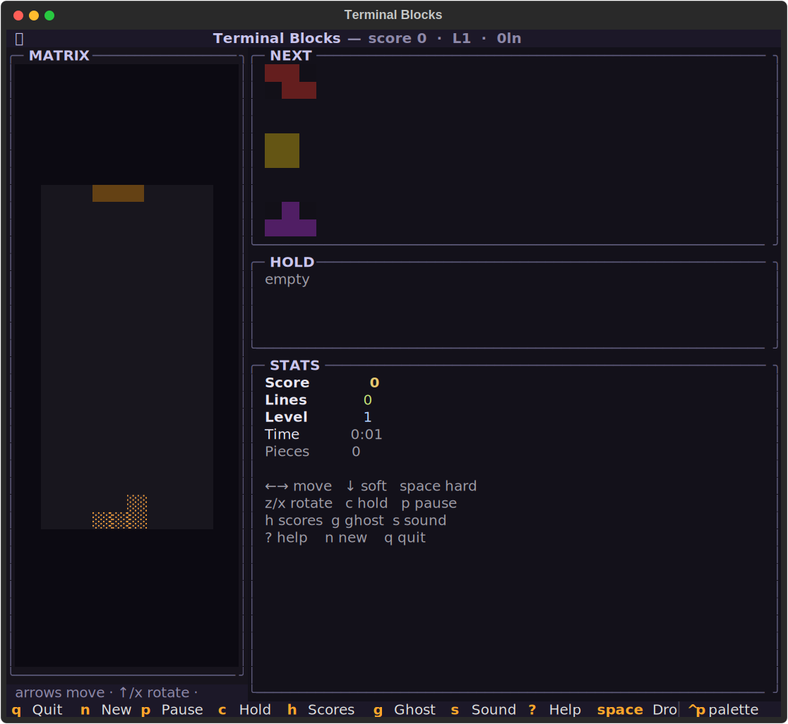
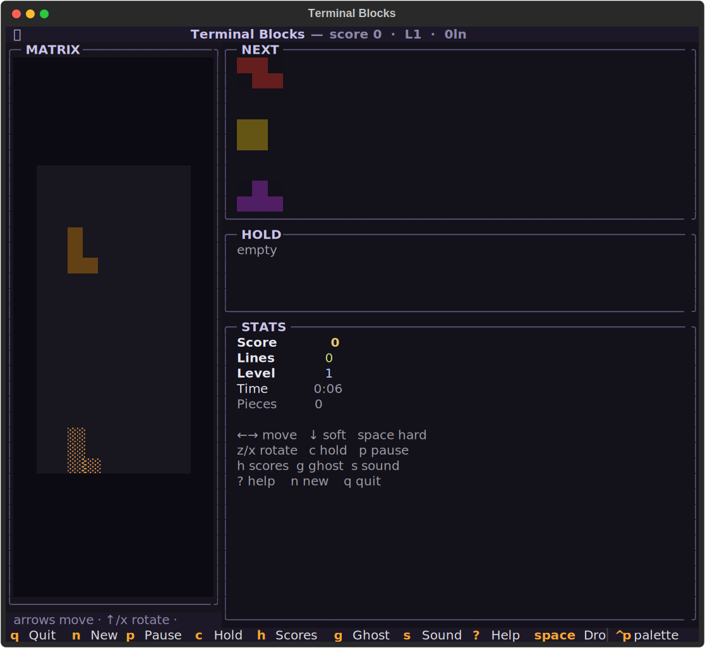
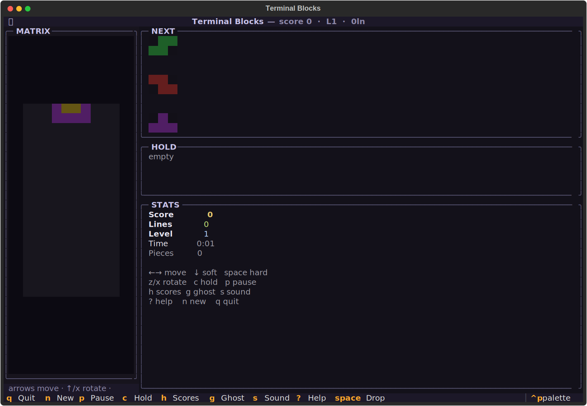

# tetromino-tui
One line at a time.





## About
SRS rotations with real wall kicks. A proper 7-bag randomizer. Hold piece, next queue, level speed ramp, mouse + keyboard. The block-stacker that has no ending — just a thinner and thinner layer of hope between you and the top-out.

## Screenshots


## Install & Run
```bash
git clone https://github.com/akakabrian/tetromino-tui
cd tetromino-tui
make
make run
```

## Controls
| key        | action                   |
|-----------:|:-------------------------|
| `← →`      | move left/right          |
| `↓`        | soft drop (+1/cell)      |
| `space`    | hard drop (+2/cell)      |
| `z`        | rotate counter-clockwise |
| `x` or `↑` | rotate clockwise         |
| `c`        | hold / swap              |
| `p`        | pause                    |
| `n`        | new game                 |
| `h`        | high-score table         |
| `g`        | toggle ghost piece       |
| `s`        | toggle sound             |
| `?`        | help overlay             |
| `q`        | quit                     |

## Testing
```bash
make test       # QA harness
make playtest   # scripted critical-path run
make perf       # performance baseline
```

## License
MIT

## Built with
- [Textual](https://textual.textualize.io/) — the TUI framework
- [tui-game-build](https://github.com/akakabrian/tui-foundry) — shared build process
